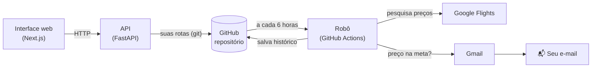

# ✈️ Rastreador de Passagens

Acompanha o preço de passagens aéreas e **envia um e-mail** quando uma rota fica dentro
do valor desejado, por exemplo: *"me avise quando São Paulo → Lisboa, saindo entre 01/12
e 20/12, custar até R$ 4.000"*.

- Roda **24 horas por dia, de graça, com o PC desligado** (no GitHub Actions).
- **Interface web** (Next.js + API em Python/FastAPI) para cadastrar rotas, testar buscas ao
  vivo e ver o histórico de preços. Também há um assistente de terminal (`Configurar.exe`).
- Duas regras de alerta: **qualquer dia** do período até o valor, ou **média** do período até o valor.
- Guarda o histórico de todos os preços encontrados (abre no Excel).
- Não repete o mesmo alerta: só avisa de novo se o preço cair pelo menos mais 3%.

> Quer entender como tudo funciona por dentro? Leia **[docs/COMO_FUNCIONA.md](docs/COMO_FUNCIONA.md)**.

## Como funciona (visão geral)



1. Você cadastra rotas na interface web, que salva em `config/rotas.json` e envia ao GitHub
   quando você clica em **Sincronizar**.
2. A cada 6 horas o GitHub liga uma máquina temporária e roda o robô (`robo.py`).
3. O robô pesquisa o preço de cada dia do período e compara com a sua meta.
4. Se estiver na meta, manda o e-mail. O histórico é salvo de volta no GitHub.

---

## Instalação passo a passo

Você vai precisar de uma conta Google (Gmail), uma conta no [GitHub](https://github.com)
(grátis) e o [Git](https://git-scm.com/download/win) instalado. Dá para instalar o Git
clicando em "Next" em tudo.

### Passo 1: Cadastrar suas rotas

Abra o **`Configurar.exe`** (ele precisa ficar dentro da pasta do projeto) e escolha:

- **2) Cadastrar nova rota:** responda às perguntas. Aceita nome de cidade ("Lisboa") e datas
  como "15/12/2026". O assistente pode pesquisar os preços de hoje para sugerir uma meta realista.
- **4) Fazer uma busca de teste:** mostra na tela os preços que o robô encontraria.

### Passo 2: Criar uma "senha de app" no Gmail

O robô envia e-mails pela sua conta Gmail. Por segurança, o Google exige uma senha especial
só para programas, diferente da sua senha normal.

1. Ative a **verificação em duas etapas**: https://myaccount.google.com/signinoptions/twosv
2. Abra https://myaccount.google.com/apppasswords, digite um nome (ex.: `Rastreador`) e clique em **Criar**.
3. Copie a senha de **16 letras** que aparece. Ela só é mostrada uma vez.
4. No `Configurar.exe`, use a opção **6) Testar envio de e-mail** para conferir.

Dicas se o teste falhar:
- Use a senha de app, **não** a senha normal do Gmail. Ela precisa ter sido criada **na mesma
  conta** que você digitou como remetente.
- Cole a senha no assistente com Ctrl+V (ou botão direito do mouse) e aperte Enter. Ela
  aparece na tela para você conferir; o assistente avisa se não chegaram 16 letras.
- Na dúvida, apague a senha de app antiga na mesma página e crie outra.

### Passo 3: Conectar ao GitHub (o servidor gratuito)

1. Crie um repositório em https://github.com/new e marque **Private**. Assim suas rotas
   e seu e-mail ficam visíveis só para você.
2. Copie o endereço que aparece (`https://github.com/seu-usuario/nome-do-repositorio.git`).
3. No `Configurar.exe`, use a opção **7) Conectar ao GitHub** e cole o endereço.
   Na primeira vez abre uma janela para você entrar na sua conta do GitHub.

### Passo 4: Guardar os dados do e-mail no GitHub ("Secrets")

Secrets são senhas guardadas de forma criptografada no GitHub. O robô consegue usá-las, mas
ninguém consegue lê-las de volta, nem você.

No seu repositório: **Settings → Secrets and variables → Actions → New repository secret**.
Crie dois:

| Name              | Secret                                   |
|-------------------|------------------------------------------|
| `GMAIL_USUARIO`   | seu Gmail, ex.: `voce@gmail.com`         |
| `GMAIL_SENHA_APP` | a senha de 16 letras do passo 2          |

### Passo 5: Ligar o robô

1. No repositório, abra a aba **Actions**. Se aparecer um botão para habilitar workflows, clique nele.
2. Clique em **Verificar preços → Run workflow** para rodar agora.
3. Clique na execução para ver o relatório. ✅ verde significa que funcionou; ❌ vermelho
   significa que algo falhou, e o GitHub também te avisa por e-mail.

Pronto. A partir daqui o robô roda sozinho às **3h, 9h, 15h e 21h** (horário de Brasília).

### No dia a dia

Abra o `Configurar.exe`, cadastre, pause ou remova rotas e use **5) Sincronizar**. Isso envia
as mudanças e baixa os preços mais recentes, que aparecem em **1) Ver minhas rotas**.

---

## Interface web

Precisa do [Node.js](https://nodejs.org) e do [pnpm](https://pnpm.io), além do Python.
Na primeira vez:

```powershell
python -m venv .venv
.venv\Scripts\pip install -r requirements-dev.txt
cd web
pnpm install
```

Depois, abra pelo atalho **"Rastreador de Passagens"** (crie com
`powershell -ExecutionPolicy Bypass -File criar_atalho.ps1`; dá para arrastar para a Área de
Trabalho ou fixar na barra de tarefas) ou pelo `iniciar.bat`.

Ele abre como um **aplicativo**: uma janela própria do Chrome (ou do Edge), sem barra de
endereço, com os servidores rodando escondidos. **Fechar a janela desliga tudo.** Se algo der
errado, os registros (logs) ficam em `%LOCALAPPDATA%\RastreadorPassagens\logs`.

Por baixo, `rastreador_app.pyw` liga a API (porta 8000) e o Next.js (porta 3000), espera os
dois responderem e abre o navegador em *modo aplicativo* (`--app=`), com um perfil próprio.

| Endereço | O que é |
|---|---|
| http://localhost:3000 | a interface: rotas, busca de teste, histórico, teste de e-mail, sincronização |
| http://localhost:8000/docs | documentação interativa da API (dá para testar cada endpoint) |

As mudanças nas rotas ficam no seu PC até você clicar em **Sincronizar** (no topo). Isso
envia as rotas ao robô e baixa os preços mais recentes que ele encontrou.

## Regras de alerta

| Regra | Avisa quando... | Bom para |
|---|---|---|
| **Menor preço** | *qualquer* dia do período custa até a meta | achar a data mais barata |
| **Média** | a *média* de todos os dias do período fica até a meta | saber quando a rota toda está barata, sem se enganar com um dia isolado |

Para não virar spam: depois de um alerta, só avisa de novo se o valor cair **mais 3%**.
Se o preço subir acima da meta e depois voltar, avisa de novo.

## Estrutura do projeto

| Arquivo | O que faz |
|---|---|
| `web/` | interface web (Next.js, React, TypeScript, Tailwind) |
| `api/` | API HTTP (FastAPI) que a interface usa; uma "casca" em volta do motor |
| `rastreador_app.pyw` | abre tudo como aplicativo (servidores escondidos + janela do Chrome/Edge) |
| `iniciar.bat` / `criar_atalho.ps1` | jeitos de abrir o app: duplo clique / atalho com ícone |
| `recursos/icone.ico` | ícone do app |
| `configurar.py` / `Configurar.exe` | assistente no terminal (alternativa à interface) |
| `robo.py` | uma rodada completa de verificação; é o que o servidor executa |
| `rastreador/config.py` | formato e validação das rotas |
| `rastreador/aeroportos.py` | traduz "Lisboa" para "LIS" |
| `rastreador/buscador.py` | pesquisa os preços no Google Flights |
| `rastreador/analise.py` | calcula menor preço e média e decide se avisa |
| `rastreador/armazenamento.py` | histórico (`dados/historico.csv`) e avisos já enviados |
| `rastreador/notificador.py` | monta e envia o e-mail |
| `rastreador/sincronizacao.py` | envia as rotas e baixa o histórico do GitHub (git) |
| `.github/workflows/verificar-precos.yml` | agenda do robô no GitHub Actions |
| `.github/workflows/testes.yml` | roda os testes automáticos a cada mudança no código |
| `tests/` | testes automáticos (45 casos) |

## Para desenvolvedores

```powershell
python -m venv .venv
.venv\Scripts\pip install -r requirements-dev.txt
.venv\Scripts\python -m pytest        # testes
.venv\Scripts\python configurar.py    # assistente sem gerar o .exe
.venv\Scripts\python robo.py          # uma rodada do robô no seu PC
.venv\Scripts\uvicorn api.main:app --reload --reload-dir api --reload-dir rastreador   # só a API
cd web; pnpm dev                      # só a interface (também: pnpm lint, pnpm build)
gerar_exe.bat                         # gera o Configurar.exe
```

## Limitações conhecidas

- **Fonte dos dados:** o Google Flights não tem API pública gratuita. Os preços são lidos da
  página, com a biblioteca [fast-flights](https://github.com/AWeirdDev/fast-flights). Se o
  Google mudar o site, pode ser preciso atualizar a biblioteca. Para uso comercial, seria
  necessária uma fonte de dados licenciada (veja o [roadmap](docs/COMO_FUNCIONA.md#9-do-projeto-pessoal-ao-produto)).
- **Horários:** o GitHub pode atrasar execuções agendadas em alguns minutos quando está sobrecarregado.
- **O que é pesquisado:** o voo mais barato de cada dia, entre os resultados que o Google mostra primeiro.
- **Preço:** é o total para todos os passageiros (ida + volta, quando for o caso) no momento da consulta.
