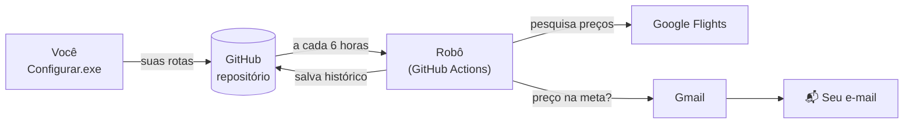
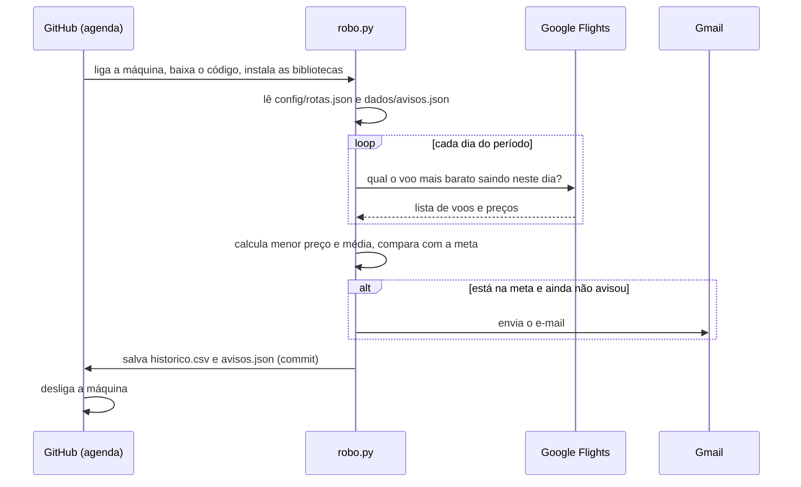

# Como funciona: guia do projeto

Este documento explica cada parte do Rastreador de Passagens de um jeito meio técnico,
meio leigo. O objetivo é que você consiga **entender, modificar e explicar** o projeto.
Leia na ordem: do panorama geral para os detalhes. Os termos técnicos estão no
[glossário](#8-glossário).

**Sumário**
1. [A ideia em uma frase](#1-a-ideia-em-uma-frase)
2. [As três peças do sistema](#2-as-três-peças-do-sistema)
3. [O que acontece numa rodada do robô](#3-o-que-acontece-numa-rodada-do-robô)
4. [Arquivo por arquivo](#4-arquivo-por-arquivo)
5. [Decisões de projeto (e por que não as alternativas)](#5-decisões-de-projeto-e-por-que-não-as-alternativas)
6. [Custos e limites](#6-custos-e-limites)
7. [Riscos e plano B](#7-riscos-e-plano-b)
8. [Glossário](#8-glossário)
9. [Do projeto pessoal ao produto](#9-do-projeto-pessoal-ao-produto)
10. [Como apresentar em entrevista](#10-como-apresentar-em-entrevista)
11. [Exercícios para aprender de verdade](#11-exercícios-para-aprender-de-verdade)

---

## 1. A ideia em uma frase

> Um robô que, de graça e sem depender do meu computador, pesquisa passagens várias vezes
> por dia e me manda um e-mail quando o preço fica bom.

**O problema:** o preço de passagem muda o tempo todo, e acompanhar isso na mão é cansativo.
Os alertas prontos (como o do próprio Google Flights) não deixam você definir a sua regra,
por exemplo "a média do período até R$ X", nem guardam um histórico seu para analisar depois.

---

## 2. As três peças do sistema

| Peça | Analogia | Onde fica |
|---|---|---|
| **Assistente** (`Configurar.exe`) | o balcão onde você faz o pedido | no seu PC |
| **Repositório no GitHub** | um caderno compartilhado, onde ficam o pedido e as anotações | na nuvem |
| **Robô** (GitHub Actions + `robo.py`) | um estagiário que a cada 6 horas lê o caderno, pesquisa, anota e te avisa se achar algo | na nuvem |

### A sacada principal: não existe um "servidor ligado 24h"

Você pediu um servidor sempre trabalhando, de graça. Manter uma máquina ligada o tempo todo
custa dinheiro e dá manutenção. Mas o robô não precisa ficar ligado: ele só precisa
**acordar de tempos em tempos**. É isso que o **GitHub Actions** oferece:

1. No horário marcado, o GitHub liga uma máquina Linux temporária.
2. Baixa o seu código, instala as bibliotecas e roda `robo.py` (uns 2 a 3 minutos).
3. **Apaga a máquina.**

Como a máquina é apagada, o robô não tem memória própria. Por isso, no fim de cada rodada,
ele **salva as anotações** (histórico de preços e avisos já enviados) de volta no repositório.
Na próxima rodada, uma máquina nova baixa o repositório e encontra tudo lá. Em inglês isso
se chama *scheduled batch job* (tarefa agendada em lote), com o Git servindo de
"banco de dados".



---

## 3. O que acontece numa rodada do robô



Um trecho real do relatório (o "log") de uma rodada:

```
[gru-rec] Recife no Natal
  GRU → REC | saída entre 18/12/2026 a 21/12/2026 | só ida | alvo R$ 1.700 (menor preço)
  4 dias com preço | menor R$ 1.346 em 21/12 | média R$ 1.628
  >>> AVISAR: menor preço atingiu a meta: R$ 1.346
  e-mail enviado para voce@gmail.com

[gru-lis] Lisboa
  GRU → LIS | saída entre 26/11/2026 a 28/11/2026 | ida e volta (14 dias) | alvo R$ 4.000 (média)
  3 dias com preço | menor R$ 3.997 em 26/11 | média R$ 4.463
  média do período R$ 4.463 acima da meta
```

Repare na rota de Lisboa: um dia custava R$ 3.997, abaixo da meta, mas a regra escolhida foi
**média**, e a média estava em R$ 4.463. Por isso não houve e-mail. É a diferença entre as duas regras.

---

## 4. Arquivo por arquivo

O código foi dividido para que **cada arquivo tenha uma responsabilidade só**
(o nome técnico disso é *separação de responsabilidades*). A pasta `rastreador/` é o
**motor**: não sabe se está sendo usada pelo robô, pelo assistente ou, no futuro, por um site.

```
rastreador/            ← o motor (reaproveitável)
  config.py            o que monitorar
  aeroportos.py        "Lisboa" → "LIS"
  buscador.py          vai ao Google Flights
  analise.py           decide se avisa
  armazenamento.py     memória (arquivos)
  notificador.py       e-mail
robo.py                ← ponta 1: o que o servidor executa
configurar.py          ← ponta 2: o assistente (vira o .exe)
.github/workflows/     ← agenda do servidor e testes automáticos
tests/                 ← testes automáticos
config/rotas.json      ← suas rotas (dados, não código)
dados/                 ← memória do robô (histórico e avisos)
```

### 4.1 `rastreador/config.py`: o que monitorar

**Em linguagem simples:** define o formato de uma "rota" e confere se ela faz sentido
antes de o robô trabalhar com ela.

Uma rota salva em `config/rotas.json` (formato **JSON**, texto organizado que humanos e
programas conseguem ler):

```json
{
  "id": "gru-lis",
  "nome": "Férias em Lisboa",
  "origem": "GRU",
  "destino": "LIS",
  "periodo_inicio": "2026-12-01",
  "periodo_fim": "2026-12-20",
  "preco_alvo": 4000,
  "email": "voce@gmail.com",
  "regra": "menor_preco",
  "dias_de_viagem": 14,
  "adultos": 1,
  "max_conexoes": null,
  "ativa": true
}
```

**Por dentro:**
- `Rota` é uma **dataclass**: uma "ficha" com campos fixos. O Python garante que todos os
  campos obrigatórios existem.
- `validar()` aplica o princípio **fail fast** (falhar cedo): se algo está errado (data
  invertida, e-mail sem @, período de 90 dias), o programa para **com uma mensagem em
  português** antes de gastar tempo pesquisando.
- **Fuso horário (um cuidado de verdade):** os servidores do GitHub usam o horário
  **UTC**, 3 horas à frente de Brasília. Às 22h de 30/09 no Brasil, o servidor já está em
  01/10. Sem cuidado, o robô poderia achar que "hoje" é amanhã e pular um dia do período.
  Por isso existe `FUSO_BRASILIA` (UTC−3) e a função `hoje()`.
- `PASTA_PROJETO`: quando o programa vira `.exe`, o Python roda de uma pasta temporária.
  Esse trecho descobre a pasta verdadeira, que é onde o `.exe` está.

### 4.2 `rastreador/aeroportos.py`: "Lisboa" → "LIS"

**Em linguagem simples:** um dicionário de cidades e seus aeroportos, para ninguém precisar
decorar códigos.

**Por dentro:**
- Os aeroportos são identificados por **códigos IATA** de 3 letras (GRU, LIS, JFK).
- `normalizar()` tira acentos e maiúsculas: "São Paulo", "sao paulo" e "SAO PAULO"
  viram a mesma coisa. Isso usa a biblioteca `unicodedata`, que separa "ã" em "a" + "~".
- `procurar()` tenta, nesta ordem: código conhecido → nome exato → parte do nome →
  qualquer código de 3 letras. Por isso "Porto" encontra Porto (OPO), não Porto Alegre,
  e "Rio" oferece Rio de Janeiro e Rio Branco.

### 4.3 `rastreador/buscador.py`: vai ao Google Flights

**Em linguagem simples:** para cada dia do período, pergunta ao Google Flights "qual o voo
mais barato saindo neste dia?" e anota a resposta.

**Por dentro:**
- **Não existe API pública e gratuita do Google Flights.** Uma API é uma "porta oficial"
  para programas conversarem. Sem ela, usamos **web scraping** (raspagem): o programa
  acessa a página como um navegador faria e lê os dados que vêm nela.
- Quem faz o trabalho pesado é a biblioteca **fast-flights**. A busca inteira (origem,
  destino, data, passageiros) é codificada dentro do endereço, no parâmetro `tfs=`. É um
  formato compacto chamado *Protocol Buffers*, convertido em texto (*base64*). A
  biblioteca monta esse endereço, finge ser um navegador Chrome e lê o resultado.
- **Retentativas com espera crescente** (*retry com backoff*): se der erro de rede, tenta
  de novo até 3 vezes, esperando 2 s, depois 4 s. Erros passageiros não derrubam a rodada.
- **Pausa entre buscas** (*rate limiting*): 2 segundos entre uma pesquisa e outra. É
  educação com o site e reduz o risco de sermos bloqueados.
- O resultado de cada dia vira um `Resultado`: data, preço, companhia, conexões e o link
  para abrir a mesma busca no navegador.

### 4.4 `rastreador/analise.py`: o cérebro

**Em linguagem simples:** recebe os preços, calcula menor preço e média, e decide
se manda e-mail.

**Por dentro:**
- É uma **função pura**: não acessa internet nem arquivos, só recebe números e devolve uma
  decisão. É a parte mais importante do sistema e, por ser pura, a mais fácil de testar.
- A regra de decisão:

| Situação | Avisa? | O que lembra |
|---|---|---|
| valor acima da meta | não | esquece o último aviso |
| chegou na meta pela primeira vez | **sim** | o valor avisado |
| já avisou, e caiu mais 3% ou mais | **sim** | o novo valor |
| já avisou, e não caiu o bastante | não | o valor antigo |

- **Por que 3%?** É o anti-spam. Preço de passagem oscila alguns reais o tempo todo. Sem
  esse limite, você receberia um e-mail a cada R$ 5 de queda. É como o ar-condicionado,
  que não liga e desliga a cada 0,1 grau. O nome técnico é **histerese**.
- **Por que "esquecer" quando sobe?** Se o preço sai da meta e depois volta, isso é
  notícia nova, e você deve ser avisado de novo.

### 4.5 `rastreador/armazenamento.py`: a memória

**Em linguagem simples:** guarda dois arquivos na pasta `dados/`:
- `historico.csv`: todo preço encontrado, uma linha por dia pesquisado. **CSV** é uma
  planilha em texto e abre direto no Excel ou no Google Sheets.
- `avisos.json`: o último valor avisado de cada rota (o que a análise "lembra").

**Por que arquivos e não um banco de dados?** O volume é pequeno (estimativa: ~4 MB por
ano com 2 rotas), você consegue ver tudo no site do GitHub e, de brinde, o Git guarda
**o histórico de cada mudança**. Num produto com muitos usuários isso mudaria (ver seção 9).

### 4.6 `rastreador/notificador.py`: o e-mail

**Em linguagem simples:** monta um e-mail bonito, com tabela de preços e botão para o
Google Flights, e envia pela sua conta Gmail.

**Por dentro:**
- **SMTP** é o protocolo padrão de envio de e-mail, como o "correio" da internet. O
  programa conecta em `smtp.gmail.com`, porta 465, com criptografia (SSL).
- **Senha de app:** o Google não deixa programas usarem sua senha normal. A senha de app
  só serve para isso e pode ser revogada a qualquer momento, sem mexer na sua conta.
- **Segredos fora do código:** a senha nunca aparece no código. O programa lê de
  **variáveis de ambiente** (`GMAIL_USUARIO`, `GMAIL_SENHA_APP`), que no servidor vêm dos
  **Secrets** do GitHub, guardados criptografados. Quem lê o código não descobre a senha.
- O e-mail vai em duas versões, **texto simples e HTML** (*multipart*), para funcionar
  em qualquer leitor de e-mail.
- `html.escape()` protege o HTML: se algum texto tiver caracteres especiais como `<`, ele
  não "quebra" o layout. Essa proteção evita um tipo de falha de segurança chamado **injeção**.
- **Conferência do certificado:** antes de mandar a senha, o programa confere o
  "documento de identidade" digital (certificado) do servidor, para garantir que está
  falando com o Gmail de verdade e não com um impostor no meio do caminho.
- **Um erro que estava escondido** (aconteceu no primeiro teste real). O teste de e-mail
  falhava com "Connection unexpectedly closed" (conexão fechada inesperadamente), que não
  diz nada. A investigação:
  1. A rede estava boa: o certificado era do Google e o servidor respondia normalmente.
  2. Com uma senha falsa, dava para ver a conversa: o Gmail responde
     `535 Username and Password not accepted` e **fecha a conexão**.
  3. A função `login()` do Python então tentava um **segundo** método de login na conexão
     já fechada. O erro verdadeiro (senha recusada) era trocado pelo genérico.

  A correção foi autenticar só com um método (`PLAIN`), para o erro real chegar até nós, e
  traduzir os códigos do Gmail em mensagens claras: 535 = senha recusada, 534 = usou a
  senha normal em vez da de app. Um teste automático com um Gmail falso (ver 4.10) garante
  que esse erro não volta.

### 4.7 `robo.py`: o maestro

**Em linguagem simples:** junta todas as peças numa rodada: lê as rotas, pesquisa,
salva, decide, avisa.

**Por dentro:**
- **Tolerância a falhas:** se uma rota falhar, as outras continuam.
- **Código de saída** (*exit code*): todo programa termina com um número. 0 significa
  "deu certo"; qualquer outro significa "falhou". Quando o robô termina com 1, o GitHub
  marca a execução com ❌ e **manda um e-mail para você**. É monitoramento de graça. O robô
  termina com 1 quando:
  - o e-mail falhou (quase sempre é senha errada);
  - **nenhuma** busca funcionou (possível bloqueio do Google);
  - faltam os Secrets no servidor. Isso é verificado logo no começo, para você descobrir
    no primeiro teste, e não só quando o preço cair.
- O aviso **só é anotado depois que o e-mail sai**. Se o envio falhar, a próxima rodada
  tenta de novo. Em termos técnicos: garantia de entrega **"pelo menos uma vez"**
  (*at-least-once*).

### 4.8 `configurar.py`: o assistente (Configurar.exe)

**Em linguagem simples:** um menu no terminal que faz perguntas e cuida de toda a parte
técnica por você.

**Por dentro:**
- **Validação de entrada:** cada pergunta repete até a resposta fazer sentido (data válida,
  número dentro do limite, aeroporto encontrado).
- **Sugestão de meta:** o assistente pesquisa os preços de hoje e sugere uma meta 10%
  abaixo. Assim a pessoa não chuta um valor impossível.
- **Automação do Git.** Os comandos que ele roda por você:

| Comando | Em português |
|---|---|
| `git init` | "passe a controlar as versões desta pasta" |
| `git add` | "separe estes arquivos para o próximo pacote" |
| `git commit -m "..."` | "feche o pacote com uma etiqueta" |
| `git remote add origin <endereço>` | "anote o endereço do repositório no GitHub" |
| `git push` | "envie os pacotes para o GitHub" |
| `git pull --rebase --autostash` | "baixe os pacotes novos (o histórico do robô) e coloque os meus por cima" |

- **PyInstaller** empacota o Python, as bibliotecas e o seu código num único `.exe`
  (por isso ele tem ~18 MB). Quem usa não precisa instalar Python. Detalhe: alguns
  antivírus desconfiam de `.exe` feitos assim. É um falso positivo comum.

### 4.9 `.github/workflows/`: a agenda do servidor

Arquivos **YAML** (texto com indentação) que dizem ao GitHub **quando** e **o que** rodar.

`verificar-precos.yml`:
- **Quando** (*triggers*, gatilhos):
  - `schedule: cron: "0 0,6,12,18 * * *"`: **cron** é o formato clássico de agenda.
    Lê-se "no minuto 0 das horas 0, 6, 12 e 18" (em UTC), ou seja, 21h, 3h, 9h e 15h em Brasília.
  - `workflow_dispatch`: cria o botão **Run workflow**, para rodar na hora.
  - `push` em `config/rotas.json`: quando você sincroniza rotas novas, o robô roda em seguida.
- `permissions: contents: write`: o robô só ganha a permissão de que precisa, que é salvar
  arquivos no repositório. É o **princípio do menor privilégio**.
- `concurrency`: nunca duas rodadas ao mesmo tempo, para não embaralhar o histórico.
- **Passos:** baixar o código → instalar Python → instalar bibliotecas → rodar o robô →
  salvar o histórico (`if: always()`: salva o que conseguiu, mesmo que algo tenha falhado).

`testes.yml`: roda os testes automáticos a cada mudança no código. Isso se chama
**CI** (*Integração Contínua*): se alguém quebrar uma regra, o GitHub mostra um ❌ antes
de o problema chegar ao robô.

### 4.10 `tests/`: os testes automáticos

**Em linguagem simples:** pequenos programas que verificam, em menos de 1 segundo, se as
regras continuam funcionando. São 39 casos, por exemplo:
- "chegou na meta pela primeira vez → avisa";
- "já avisou e caiu só 2% → não avisa";
- "regra média ignora um dia barato isolado";
- "período maior que 60 dias → erro com mensagem";
- "'são paulo' encontra GRU, CGH e VCP";
- "Gmail recusou a senha → mensagem diz 'recusou o login', não 'conexão fechada'".

**Por que não testamos o Google?** Os testes automáticos cobrem a **lógica**, que é nossa e
não muda sozinha. O Google é externo e instável: testar ele automaticamente daria falhas
aleatórias. Para ele existe a **busca de teste** do assistente (opção 4). Essa divisão é o
que se chama de *pirâmide de testes*: muitos testes rápidos na lógica, poucas verificações
manuais nas integrações externas.

**E o e-mail, como se testa sem enviar e-mail?** Com um **dublê** (*mock*). Em
`tests/test_notificador.py`, um "Gmail falso" substitui o verdadeiro durante o teste e
imita cada situação: senha recusada, senha normal no lugar da de app, destinatário
inválido, conexão caindo. Assim testamos como o programa **reage** a cada problema, sem
internet e sem senha real.

Para rodar: `.venv\Scripts\python -m pytest -v`

---

## 5. Decisões de projeto (e por que não as alternativas)

Saber **por que** algo foi escolhido vale mais em entrevista do que saber **o que** foi feito.

| Decisão | Alternativas consideradas | Por que esta | O que se perde |
|---|---|---|---|
| **GitHub Actions agendado** | PC ligado + Agendador do Windows; servidor virtual (VPS); plataformas como Render | grátis, sem manutenção, funciona com o PC desligado | horários podem atrasar alguns minutos; cota mensal de minutos |
| **Raspagem do Google Flights** | APIs pagas de dados de voos (ex.: Duffel, SerpApi) | grátis e com os mesmos preços que você vê no site | frágil a mudanças do site; não serve para uso comercial |
| **CSV/JSON no próprio repositório** | banco de dados (SQLite, PostgreSQL) | zero infraestrutura, versionado, abre no Excel | não escala para muitos usuários |
| **Gmail com senha de app** | serviços de e-mail transacional (Resend, Brevo, SendGrid) | grátis e simples para uso pessoal | limite de ~500 e-mails/dia; menos adequado para produto |
| **Terminal + .exe** | aplicativo com janelas; site | foco no motor primeiro, como pedido; o motor serve para qualquer interface futura | menos amigável que uma tela |
| **4 verificações por dia** | a cada hora | preço de passagem não muda de minuto a minuto; economiza cota e reduz risco de bloqueio | pode perder uma promoção relâmpago de poucas horas |
| **Duas regras (menor preço e média)** | só uma | "média" pode significar coisas diferentes; as duas cobrem os dois casos | uma pergunta a mais no cadastro |
| **Repositório privado** | público (minutos ilimitados) | suas rotas e seu e-mail não ficam expostos | cota de minutos (ver seção 6) |

---

## 6. Custos e limites

**Custo total hoje: R$ 0.** Os limites que importam:

**Minutos do GitHub Actions.** Repositórios privados no plano gratuito têm uma cota mensal
de minutos: 2.000 min/mês quando este projeto foi feito. Confira em
*Settings → Billing* da sua conta. A conta aproximada:

- Cada rodada ≈ 1 min de preparação + ~3 s por dia pesquisado (medido nos testes).
- Exemplo: 2 rotas × 20 dias = 40 buscas ≈ 2 min, ou seja, ~3 min por rodada.
- 4 rodadas/dia × 30 dias × 3 min ≈ **360 min/mês, cerca de 18% da cota**.

**Gmail:** cerca de 500 e-mails por dia. Sobra muito para uso pessoal.

**Tamanho do período:** até 60 dias por rota, porque cada dia é uma busca.

**Histórico:** ~4 MB por ano com 2 rotas. Irrelevante.

---

## 7. Riscos e plano B

| Risco | Como você percebe | O que fazer |
|---|---|---|
| Google bloquear o servidor ou mudar a página | ❌ no Actions com "nenhum preço encontrado" e e-mail do GitHub | atualizar a biblioteca (`fast-flights` em `requirements.txt`); reduzir a frequência; em último caso, migrar para uma API paga |
| Preço visto do servidor (nos EUA) diferente do que você vê no Brasil | compare o valor do e-mail com o site | testamos uma rota nacional e os preços foram iguais; se divergir, dá para fixar o país da busca como Brasil |
| Agendamento atrasar ou pular um horário | horários irregulares na aba Actions | normal no GitHub, não afeta o objetivo |
| Senha de app revogada | ❌ com "O Gmail recusou o login" | gerar nova senha e atualizar o Secret |
| Cota de minutos acabando | aviso do GitHub | diminuir períodos ou frequência |

**Checklist da primeira semana:**
1. A primeira execução manual (**Run workflow**) terminou com ✅?
2. Os preços do relatório batem com o que você vê no Google Flights?
3. **Force um alerta:** crie uma rota com meta bem alta (ex.: R$ 50.000). O e-mail chegou?
   Não caiu no spam? Depois remova a rota.
4. Depois de alguns dias, o `dados/historico.csv` está crescendo?

---

## 8. Glossário

| Termo | Significado |
|---|---|
| **API** | "porta oficial" para um programa conversar com outro serviço |
| **Web scraping** (raspagem) | ler dados de uma página feita para humanos, como um navegador faria |
| **IATA** | órgão que define os códigos de 3 letras dos aeroportos (GRU, LIS) |
| **Repositório** | pasta de projeto controlada pelo Git, com todo o histórico de mudanças |
| **Git / GitHub** | Git é o programa que controla versões; GitHub é o site que guarda os repositórios na nuvem |
| **Commit** | um "pacote" de mudanças com uma mensagem, como um ponto salvo num jogo |
| **Push / Pull** | enviar / baixar commits do GitHub |
| **GitHub Actions** | serviço do GitHub que roda programas em máquinas temporárias |
| **Workflow** | a receita (arquivo YAML) do que o Actions deve rodar e quando |
| **Cron** | formato de agenda: minuto, hora, dia, mês, dia da semana |
| **UTC** | horário universal de referência; Brasília é UTC−3 |
| **Secret** | senha guardada criptografada no GitHub, usada pelo robô sem ficar visível |
| **Variável de ambiente** | valor entregue ao programa pelo sistema, fora do código |
| **SMTP** | protocolo de envio de e-mail |
| **Senha de app** | senha do Google só para um programa, revogável |
| **JSON / CSV / YAML** | formatos de texto para dados: estruturado / planilha / configuração |
| **Dataclass** | no Python, uma "ficha" com campos definidos |
| **Função pura** | função que só depende do que recebe e não mexe em nada externo; fácil de testar |
| **Teste unitário** | pequeno programa que verifica uma regra isolada |
| **Mock** (dublê de teste) | peça falsa que imita uma peça real (ex.: o Gmail) durante um teste |
| **Certificado** (TLS/SSL) | "documento de identidade" digital de um site ou servidor |
| **CI** (integração contínua) | rodar os testes automaticamente a cada mudança |
| **Exit code** | número com que um programa termina: 0 = sucesso |
| **Retry com backoff** | tentar de novo esperando cada vez mais |
| **Rate limiting** | limitar o ritmo de requisições para não sobrecarregar um serviço |
| **Histerese** | margem para não ficar "ligando e desligando" com pequenas variações |
| **Fail fast** | detectar erros o mais cedo possível, com mensagem clara |
| **At-least-once** | garantia de que algo acontece pelo menos uma vez, mesmo com falhas |
| **PyInstaller** | ferramenta que transforma um programa Python num `.exe` |
| **venv** (ambiente virtual) | pasta com as bibliotecas do projeto, separadas do resto do PC |
| **Biblioteca / dependência** | código pronto de terceiros que o projeto usa (listado em `requirements.txt`) |

---

## 9. Do projeto pessoal ao produto

O plano é usar, avaliar e depois disponibilizar para outras pessoas. O que muda em cada fase:

**Fase 1: uso pessoal (agora).** Validar o essencial: os alertas chegam? Os preços batem?
As regras são úteis? Anote o que te incomoda. Isso vira a lista de melhorias.

**Fase 2: melhorias ainda pessoais** (ideias):
- **Resumo semanal:** um e-mail toda segunda com o menor preço de cada rota, mesmo sem alerta.
- **Gráfico** da evolução do preço, a partir do `historico.csv`.
- **Vários aeroportos numa rota** (GRU + CGH + VCP para "São Paulo").
- **Meta automática:** "avise quando estiver 15% abaixo da média histórica desta rota",
  em vez de um valor fixo.
- **Outros canais:** Telegram ou WhatsApp.

**Fase 3: produto para outras pessoas.** O que precisa mudar e por quê:

| Hoje | No produto | Motivo |
|---|---|---|
| raspagem do Google | fonte de dados licenciada (API paga) | os termos de uso do Google não permitem uso comercial da raspagem, e ela é instável |
| rotas num arquivo | cadastro por site ou formulário, dados num banco (ex.: PostgreSQL) | vários usuários, cada um vendo só as próprias rotas |
| Gmail pessoal | serviço de e-mail transacional com domínio próprio e link de descadastro | volume, entregabilidade e boas práticas |
| e-mails num repositório | dados pessoais protegidos, política de privacidade, exclusão a pedido | **LGPD** |
| uma busca por rota | **deduplicação**: se 50 pessoas querem GRU→LIS em dezembro, pesquisa uma vez só | custo e velocidade |
| log no GitHub | monitoramento, métricas e alertas de falha | confiabilidade |

O motor (`rastreador/`) continua valendo. Trocam-se as "pontas": entrada (site em vez de
`rotas.json`) e armazenamento (banco em vez de CSV).

---

## 10. Como apresentar em entrevista

### O pitch de 30 segundos

> "Criei um rastreador de preços de passagens que roda sozinho na nuvem, a custo zero. Um
> job agendado no GitHub Actions pesquisa o Google Flights quatro vezes por dia, aplica uma
> regra de alerta configurável (menor preço ou média de um período de datas) e manda e-mail
> pelo Gmail, com um mecanismo anti-spam. O histórico fica versionado no próprio
> repositório. Tem um assistente de terminal empacotado como .exe, para qualquer pessoa
> configurar, e testes automatizados rodando em CI. Também mapeei o que muda para virar
> produto: fonte de dados licenciada, banco multiusuário e LGPD."

### Sobre ter usado IA: seja transparente, é um ponto a favor

Diga algo como: *"Desenvolvi com um assistente de IA. Eu defini os requisitos, tomei as
decisões de arquitetura com base nos trade-offs, validei e testei, e sei explicar cada
parte."* Hoje, saber especificar, revisar e validar o que a IA produz é uma
competência valorizada. O que pega mal é dar a entender que escreveu tudo à mão e travar
numa pergunta. Por isso este documento e os exercícios da seção 11 existem.

### Perguntas prováveis e como responder

**"Por que GitHub Actions e não um servidor?"**
A tarefa é periódica: não precisa de nada ligado o tempo todo. O Actions dá execução
agendada grátis e sem manutenção. O custo é o atraso ocasional do agendamento e a cota
de minutos, que calculei: uso ~18% dela.

**"Se a máquina é apagada, como o sistema lembra das coisas?"**
O estado (histórico e avisos enviados) é salvo como commit no repositório no fim de cada
rodada. Uso o Git como um banco de dados simples, com versionamento de brinde.

**"Como evita mandar o mesmo e-mail várias vezes?"**
Guardo o último valor avisado por rota. Só aviso de novo se cair mais 3% (histerese). Se
o preço sai da meta, o estado é zerado para avisar quando voltar.

**"E se o Google bloquear?"**
Há retentativas com espera crescente e pausa entre buscas. Se nada funcionar, o robô
termina com código de erro e o GitHub me notifica. O plano B é uma API paga de dados de
voos, já mapeada no roadmap.

**"Onde ficam as senhas?"**
Em Secrets do GitHub, entregues como variáveis de ambiente, nunca no código. E é uma
senha de app, revogável e sem acesso à conta inteira.

**"Como você testa?"**
Testes unitários com pytest na lógica pura (decisão de alerta, validação, busca de
aeroportos), incluindo testes parametrizados, rodando em CI a cada push. A integração
com o Google é validada manualmente pela busca de teste, porque um serviço externo em
teste automático geraria falhas aleatórias.

**"Teve algum cuidado ou bug interessante?"**
O melhor exemplo veio do primeiro teste real. O envio de e-mail falhava com um erro
genérico, "Connection unexpectedly closed". Em vez de sair chutando, isolei as partes:
primeiro a rede (certificado do Google ok, servidor respondendo), depois o login com uma
credencial falsa, observando a conversa com o servidor. Descobri que o Gmail recusa a
senha e fecha a conexão, e que a biblioteca do Python tentava um segundo método de login
na conexão fechada, escondendo o erro real. Corrigi para o motivo verdadeiro aparecer,
traduzi os códigos do Gmail em mensagens claras e criei testes com um servidor falso para
o problema não voltar. Aproveitei para melhorar a experiência: o programa passou a
conferir se a senha colada tem 16 letras e a entender "s" como "sim". E a causa original
era de usabilidade: o campo de senha era invisível, e nesse modo o cmd não aceita Ctrl+V.
O atalho chegava como um caractere de controle no lugar da senha. Tornei o campo visível,
um trade-off consciente: é uma senha de app, que só envia e-mail e pode ser revogada.

Outro cuidado, mais preventivo: fuso horário. Os servidores rodam em UTC, então entre 21h
e meia-noite de Brasília o servidor já está no dia seguinte e poderia pular um dia do
período. Resolvi fixando o fuso de Brasília. E mais um: verifiquei se o preço retornado era
por pessoa ou total comparando 1 e 2 adultos (R$ 1.584 contra R$ 3.168). É total.

**"Como escalaria para mil usuários?"**
Veja a Fase 3: banco de dados, deduplicação de buscas iguais, fila de trabalho, fonte de
dados licenciada e e-mail transacional.

**"O que você faria diferente?"**
Boa resposta honesta: para produto, começaria já com uma fonte de dados licenciada, porque
a raspagem é o ponto mais frágil. Para uso pessoal, ela é a escolha certa pelo custo zero.

---

## 11. Exercícios para aprender de verdade

Entender de verdade vem de mexer. Do mais fácil para o mais difícil:

1. **Rode os testes** (`.venv\Scripts\python -m pytest -v`) e leia os nomes: cada um é uma regra do sistema.
2. **Quebre de propósito:** em `rastreador/analise.py`, troque `valor > rota.preco_alvo` por
   `valor >= rota.preco_alvo`. Rode os testes: qual falha, e por quê? Depois desfaça.
3. **Mude o anti-spam** `QUEDA_MINIMA_PARA_NOVO_AVISO` para `0.05` (5%) e rode os testes.
   Surpresa: nenhum falha! Por quê? Dica: veja os números dos testes "queda pequena" (2%) e
   "queda grande" (8%). Escreva um teste novo, com uma queda de 4%, que teria pegado essa
   mudança. É assim que se descobre o que os testes **não** cobrem.
4. **Adicione uma cidade** em `rastreador/aeroportos.py` (ex.: Caxias do Sul, código `CXJ`) e
   um caso novo em `tests/test_config.py`.
5. **Abra `dados/historico.csv` no Excel** e faça um gráfico de preço ao longo das consultas.
6. **Leia um relatório do robô:** no GitHub, aba Actions, abra uma execução e ache a linha "AVISAR" ou "acima da meta".
7. **Mude a agenda** para rodar também à meia-noite de Brasília. Dica: meia-noite em Brasília = 3h em UTC.
8. **Desafio:** implemente o resumo semanal (um novo workflow com cron semanal e uma nova
   função no `notificador.py`).
